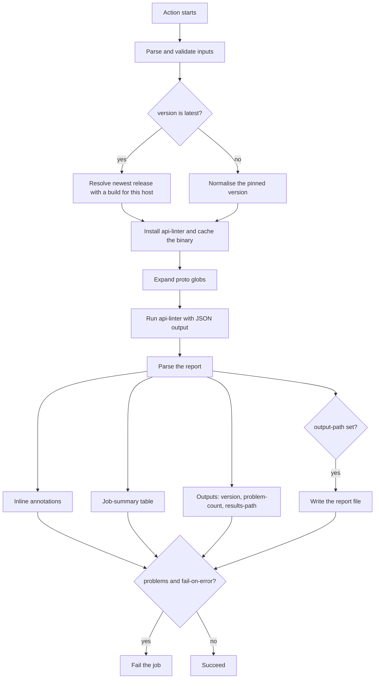

# Setup Google API Linter

A GitHub Action that installs and runs the
[Google AIP **api-linter**](https://github.com/googleapis/api-linter) against
your Protocol Buffer files. It downloads a pinned (or the latest) linter
release, lints your protos, and surfaces the results as inline annotations, a
job-summary table, action outputs, and an optional report file.

## Table of contents

The table of contents below maps the whole document. Each entry is a link to
the matching section, so you can jump straight to what you need instead of
scrolling: skim [Features](#features) and [Quick start](#quick-start) to get
running, use [Inputs](#inputs) and [Outputs](#outputs) as the configuration
reference, and see [Contributing](#contributing) and [License](#license) for
project and legal details.

- [How it works](#how-it-works)
- [Features](#features)
- [Quick start](#quick-start)
- [Inputs](#inputs)
- [Outputs](#outputs)
- [How results are surfaced](#how-results-are-surfaced)
- [Supported runners](#supported-runners)
- [Why the bundle is committed](#why-the-bundle-is-committed)
- [Versioning](#versioning)
- [Contributing](#contributing)
- [License](#license)

## How it works



## Features

- Installs any published `api-linter` version, or resolves `latest`.
- Caches the binary across runs via the Actions tool cache.
- Inline pull-request annotations for every rule violation.
- Job-summary table with a link to each AIP rule.
- Optional machine-readable report (`json`, `yaml`, `github`, `summary`).
- Supports config files, import paths, rule toggles and descriptor sets.
- Written entirely in documented TypeScript.

## Quick start

```yaml
name: API lint
on: [pull_request]
permissions:
  contents: read
jobs:
  lint:
    runs-on: ubuntu-latest
    steps:
      - uses: actions/checkout@v4
      - uses: the-protobuf-project/setup-google-api-linter@v1
        with:
          paths: proto/**/*.proto
```

By default the action lints `**/*.proto`, installs the latest linter, annotates
each problem, writes a job summary, and fails the job if any problem is found.

## Inputs

| Input                     | Default        | Description                                                            |
| ------------------------- | -------------- | --------------------------------------------------------------------- |
| `version`                 | `latest`       | api-linter version to install (e.g. `1.69.2`, `v1.69.2`) or `latest`. |
| `paths`                   | `**/*.proto`   | Newline/comma-separated globs of proto files to lint.                 |
| `config`                  | `""`           | Path to an api-linter config file (YAML or JSON).                     |
| `proto-paths`             | `""`           | Newline/comma-separated import search dirs, passed as `-I`.           |
| `enable-rules`            | `""`           | Newline/comma-separated rule names to enable.                         |
| `disable-rules`           | `""`           | Newline/comma-separated rule names to disable.                        |
| `ignore-comment-disables` | `false`        | Ignore in-proto disable comments (strict enforcement).                |
| `descriptor-set-in`       | `""`           | Newline/comma-separated FileDescriptorSet files for imports.          |
| `skip-compilation`        | `false`        | Skip compilation and lint `descriptor-set-in` instead.                |
| `buf`                     | `false`        | Resolve `buf.yaml` dependencies (via buf) before linting.             |
| `buf-input`               | `.`            | buf input to export when `buf` is enabled (a dir with `buf.yaml`).    |
| `buf-config`              | `""`           | Path to a specific `buf.yaml`, passed to buf as `--config`.           |
| `buf-path`                | `""`           | Path to a `buf` executable; used instead of PATH/auto-install.        |
| `buf-version`             | `latest`       | buf CLI version to install when buf is not already on PATH.           |
| `output-format`           | `json`         | Report file format: `json`, `yaml`, `github` or `summary`.            |
| `output-path`             | `""`           | Where to write the report. When set, exposed via `results-path`.      |
| `annotate`                | `true`         | Emit inline GitHub annotations for each problem.                      |
| `job-summary`             | `true`         | Write a results table to the job summary.                             |
| `fail-on-error`           | `true`         | Fail the job when one or more problems are reported.                  |
| `working-directory`       | `.`            | Directory to resolve paths and run the linter from.                   |
| `github-token`            | `github.token` | Token used when resolving `latest` and downloading the release.       |

## Outputs

| Output          | Description                                                       |
| --------------- | ---------------------------------------------------------------- |
| `version`       | The concrete api-linter version that was installed.              |
| `problem-count` | Total number of problems reported across all files.              |
| `results-path`  | Absolute path to the written report, when `output-path` was set. |

## How results are surfaced

- **Annotations** — each problem becomes an inline error annotation on the
  relevant proto line (disable with `annotate: false`).
- **Job summary** — a table of file, line, rule and message, with each rule
  linking to its page on [linter.aip.dev](https://linter.aip.dev)
  (disable with `job-summary: false`).
- **Report file** — set `output-path` to write the full report in
  `output-format` for archiving or downstream tooling.
- **Outputs** — read `problem-count`, `version` and `results-path` in later
  steps.

See [`docs/examples.md`](docs/examples.md) for config files, import paths, rule
overrides, descriptor sets, artifact uploads and more.

## Resolving Buf dependencies

If your protos import types managed by [Buf](https://buf.build) — for example
`google/api/*` pulled from the Buf Schema Registry via `buf.yaml` `deps` — set
`buf: true`. The action runs `buf export` to materialise those dependencies onto
disk and adds them to api-linter's import paths, so imports resolve instead of
failing. buf is used from `PATH` when present, otherwise it is installed
automatically — or point `buf-path` at your own `buf` executable. To use a
`buf.yaml` that lives outside the input directory, set `buf-config` to its path.

```yaml
- uses: the-protobuf-project/setup-google-api-linter@v1
  with:
    buf: true
    working-directory: proto # directory containing buf.yaml
    paths: "**/*.proto"
```

A complete, AIP-compliant example module lives in
[`examples/buf`](examples/buf); it is exercised end-to-end by the golden test.

## Supported runners

api-linter publishes binaries for these platforms, all of which this action
supports:

| OS      | Architecture | GitHub-hosted runner |
| ------- | ------------ | -------------------- |
| Linux   | amd64, arm   | `ubuntu-latest`      |
| macOS   | amd64, arm64 | `macos-latest`       |
| Windows | amd64        | `windows-latest`     |

Linux `arm64` is not published upstream and is therefore unsupported; the
action fails with a clear message on unsupported hosts.

### Releases with missing builds

Not every upstream release attaches a build for every platform. api-linter
v2.4.0, for example, published a single `api-linter.tar.gz` containing a
Windows binary and no Linux or macOS build at all.

`version: latest` therefore selects the newest release that actually publishes
an asset for the host platform, logging a warning for each release it skips,
rather than resolving to the newest tag and failing the download. A pinned
`version` is used as given: if that release has no build for the host, the
action fails with a message naming the platform and the URL it tried.

## Why the bundle is committed

GitHub runs a JavaScript action by executing its compiled entry point directly
from the repository at the ref you pin — it does not run `bun install` or
`bun run build` for you. The bundled `dist/index.js` (produced by `bun run
build`) is therefore committed to the repository, and CI fails if it drifts
from `src/`. Rebuild and commit `dist/` after any change under `src/`.

## Versioning

- Reference a released major tag (`@v1`) for stability, or a full commit SHA for
  maximum pinning.
- **No auto-fix** — api-linter is a linter, not a formatter, so it does not
  rewrite protos. This action surfaces problems (including any `suggestion`
  fields) and can persist a report; applying changes is left to you.

## Contributing

Contributions are welcome. See [`CONTRIBUTING.md`](CONTRIBUTING.md) for the
development workflow, coding standards, and how to run `bun run all` before
opening a pull request. In short: this project uses [Bun](https://bun.com), all
code is documented TypeScript, and every file stays under 200 lines.

## License

Licensed under the Apache License, Version 2.0. See [`LICENSE`](LICENSE) for the
full text and [`NOTICE`](NOTICE) for attribution.

`api-linter` is a separate Google project, also under Apache-2.0; this action
installs and invokes it but does not redistribute it.
